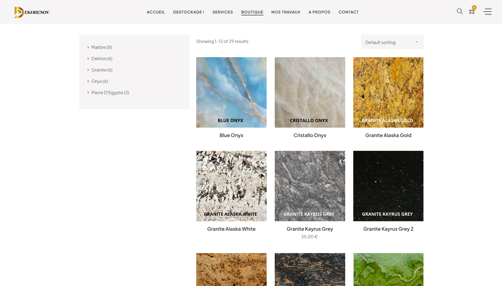
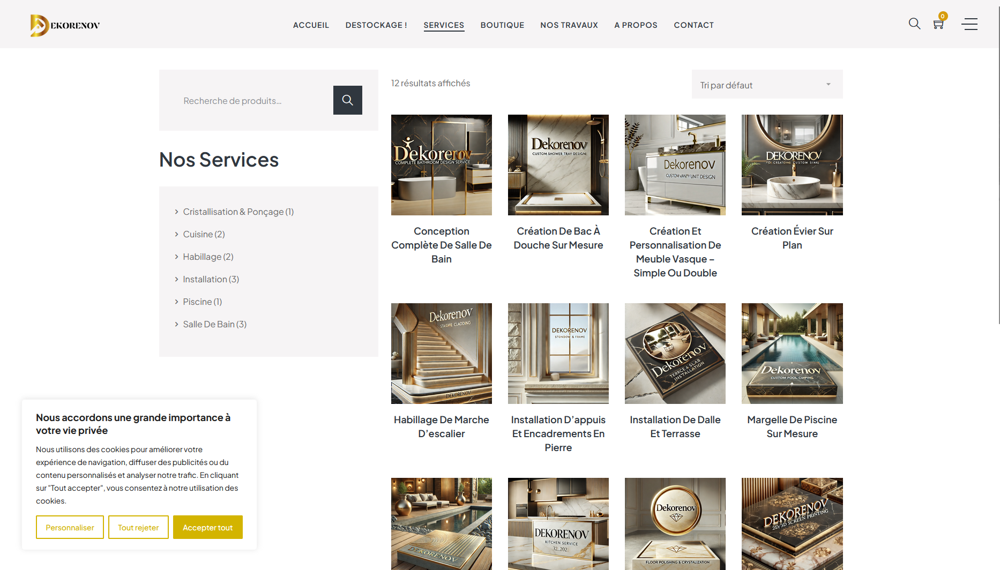

# CNX – Plateforme Web MVC & Boutique B2B – Dekorenov.pro

🔗 Site client (public) : https://dekorenov.pro

Plateforme web professionnelle développée pour une entreprise spécialisée
dans la **marbrerie, la pierre naturelle et la rénovation**, combinant :
- un **site web MVC sur mesure**
- un **back-office WordPress**
- une **boutique B2B dédiée aux professionnels** (vente en gros)

---

## 🖼️ Aperçu de la plateforme

> Captures issues de l’interface publique (données sensibles non exposées)

---

## 1️⃣ Analyse du Besoin

Dekorenov est une entreprise artisanale et technique opérant dans le domaine
de la marbrerie et de la rénovation (intérieur et extérieur).

Les enjeux identifiés étaient multiples :

- ❌ Manque de visibilité sur les moteurs de recherche
- ❌ Absence de plateforme professionnelle pour la vente en gros
- ❌ Gestion des contenus peu flexible pour l’équipe métier
- ❌ Difficulté à adresser à la fois le **B2C** (clients finaux)
  et le **B2B** (professionnels du bâtiment, architectes, revendeurs)

L’objectif était de disposer d’un **site web robuste, administrable
et évolutif**, capable de soutenir l’activité commerciale professionnelle.

---

## 2️⃣ Solution Proposée

Conception et développement d’une **plateforme web hybride** reposant sur :

- Une **architecture MVC sur mesure** pour le site public
- Un **back-office WordPress** pour l’administration des contenus
- Une **boutique B2B** dédiée à la vente de marbre en gros

Cette approche permet de combiner :
- performance
- flexibilité métier
- autonomie côté client
- évolutivité long terme

---

## 3️⃣ Approche Fonctionnelle

### 🌐 Site Web MVC
- Architecture MVC claire et maintenable
- Pages services et présentation optimisées
- Séparation stricte logique métier / affichage

### 🧩 Back-office WordPress
- Administration simplifiée des contenus
- Gestion autonome des pages et médias
- Interface accessible aux équipes non techniques

### 🛒 Boutique B2B (Professionnels)
- Catalogue de marbre et matériaux
- Accès réservé aux professionnels
- Logique de vente en gros
- Demande de devis / contact commercial

---

## 4️⃣ Architecture & Choix Techniques

- **Architecture** : MVC sur mesure
- **CMS Admin** : WordPress
- **Base de données** : MySQL
- **Boutique** : catalogue B2B dédié
- **SEO** : structure technique optimisée
- **Sécurité** : accès restreints pour l’espace pro

Les choix ont été guidés par :
- la maintenabilité du code
- la facilité de gestion des contenus
- les exigences SEO
- la séparation claire des responsabilités

---

## 5️⃣ Mise en Œuvre

- Conception de l’architecture MVC
- Intégration du back-office WordPress
- Développement du catalogue produits B2B
- Structuration des contenus SEO
- Optimisation des performances
- Tests fonctionnels B2C / B2B

---

## 6️⃣ Résultats & Valeur Apportée

- ✅ Plateforme professionnelle et crédible
- ✅ Autonomie complète du client pour la gestion des contenus
- ✅ Meilleure visibilité sur les moteurs de recherche
- ✅ Base solide pour la vente en gros auprès des professionnels
- ✅ Séparation claire entre site vitrine et logique commerciale

---

## 7️⃣ Scalabilité & Évolutivité

La plateforme a été conçue pour évoluer :

- Extension de la boutique B2B
- Gestion avancée des comptes professionnels
- SEO local et national
- Ajout de fonctionnalités e-commerce avancées
- Connexion à des outils CRM ou ERP

---

## 📄 Documentation Technique & SEO

- [Architecture technique](docs/architecture/overview.md)
- [Stratégie SEO](docs/architecture/seo-strategy.md)

---

## 🔒 Confidentialité

Ce repository présente la solution d’un point de vue
fonctionnel et architectural.
Les accès administrateurs, données clients et règles
commerciales spécifiques ne sont pas exposés.
